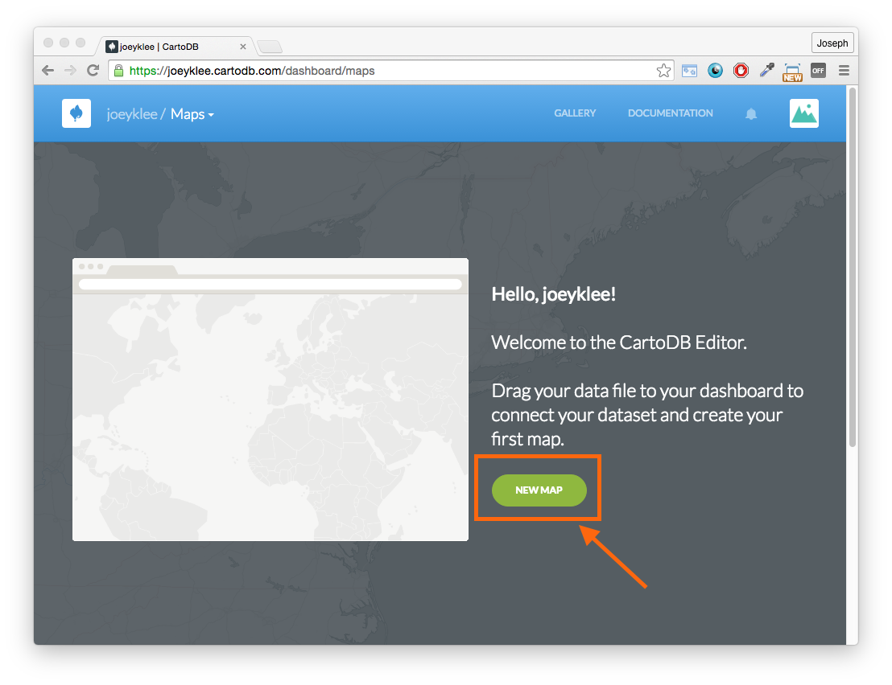

# Friendly CartoDB Introduction
This is a friendly introduction to web mapping using CartoDB. 

## Overview
#### Making Maps On the Web, for the Web

### Data Creation & Upload
#### Making data pt. I
* Making data with [Geojson.io](http://geojson.io/)

#### Getting Started with CartoDB:
* Sign up

#### Making data pt. II
* Making data with [CartoDB - adding geometries](https://docs.cartodb.com/tutorials/adding_geometries/)

#### Data Acquisition:
* Sources of data:
	* OpenStreetMap:
		* [Mapzen OSM Metro Extracts](https://mapzen.com/data/metro-extracts/)
	* Open Data Catalogs:
		* [Vancouver Open data](http://data.vancouver.ca/datacatalogue/index.htm)
		* [Toronto Open Data](http://www1.toronto.ca/wps/portal/contentonly?vgnextoid=1a66e03bb8d1e310VgnVCM10000071d60f89RCRD)
		* [San Francisco Open Data](https://data.sfgov.org/)
		* ...do a web search for "city" + "open data"
	* University data sets:
		* [UBC GIS Data](http://help.library.ubc.ca/finding-resources/geographic-information-systems/)
	* Open Research Data:
		* [Zenodo](https://zenodo.org/)
		* [Figshare](https://figshare.com/)
	* Blogs:
		* [RT Wilson's Blog of data sources](http://freegisdata.rtwilson.com/)
		* ... do a web search "gis" + data sources

### Building our First Visualization with CartoDB
#### Data
* Twitter Data
* Metro Vancouver boundaries
#### The Style Wizard
* Using different visual representations
#### Animating points
* Animating time series data
#### Filtering Data
* Filtering data
#### Spatial Join/Data Merge
* Merging data and spatial joins
#### Choropleth Maps
* Your first choropleth
#### Popups
* adding tool tips
#### Adding Text
* adding text to a map
#### Share!


<!--### Data Creation & Data Import Pt. I:
#### Create data
* Making data with [Geojson.io](http://geojson.io/)
* Making data with [CartoDB - adding geometries](https://docs.cartodb.com/tutorials/adding_geometries/)

#### Data Import:
* "Connect Data Source" using CartoDB

#### Data Acquisition:
* Sources of data:
	* OpenStreetMap:
		* [Mapzen OSM Metro Extracts](https://mapzen.com/data/metro-extracts/)
	* Open Data Catalogs:
		* [Vancouver Open data](http://data.vancouver.ca/datacatalogue/index.htm)
		* [Toronto Open Data](http://www1.toronto.ca/wps/portal/contentonly?vgnextoid=1a66e03bb8d1e310VgnVCM10000071d60f89RCRD)
		* [San Francisco Open Data](https://data.sfgov.org/)
		* ...do a web search for "city" + "open data"
	* University data sets:
		* [UBC GIS Data](http://help.library.ubc.ca/finding-resources/geographic-information-systems/)
	* Open Research Data:
		* [Zenodo](https://zenodo.org/)
		* [Figshare](https://figshare.com/)
	* Blogs:
		* [RT Wilson's Blog of data sources](http://freegisdata.rtwilson.com/)
		* ... do a web search "gis" + data sources

#### Visualization Pt.I
* The cartodb viz wizard
* legends
* Basemaps
* labels

#### Data Merging
* data merging

#### Simple Data Filtering
* Filtering using sliders

#### Visualization Pt.II
* torque - animations
* adding labels and 


#### Export & Share
* Export to web 
* Export data-->


***

## Making maps on the Web, for the Web
In this workshop we're going to be using CartoDB - a Software as a Service (SaaS) cloud computing platform that provides GIS and web mapping tools for display **in a web browser**. CartoDB users can use the company's free platform or deploy their own instance of the open source software. CartoDB is offered as freemium service, where accounts are free up to a certain size. For larger accounts, a fee is applied.

The great thing about using web-based GIS and mapping tools is that there's basically no setup - you just sign up with CartoDB and start mapping. For anyone who has set up GIS software for desktop, you might understand why this is so amazing. 

Here's a little tour of CartoDB:

(insert video here)


## Data Creation & Upload pt.1


What does it mean to make a map? In many ways it means to create geographic data. This could be in the form of points, lines, and polygons (vector data) or in the form of images (raster data). I won't go into a lot of detail here about geographic data types, but you can find out more about these types of data [here](). 

### Data Creation with Geojson.io

#### Making data
So let's say, we wan't to create some geographic data - How do we do this? There are a number of tools that exist for making geographic data. In the past, most of the geographic data production was either done the old school way - pen and paper - and using desktop GIS software. However, the web has become/is becoming ever more *the place* where geographic data is being and can be generated. Let's look at one called [geojson.io](http://geojson.io/). 


<iframe width="420" height="315" src="https://www.youtube.com/embed/kr3d6SQvZ6o" frameborder="0" allowfullscreen></iframe>

***NOTE: In the video, I mix points, lines, and polygons in the same file - try to avoid this!!! Points with points, lines with lines, polygons with polygons!***

You can use geojson.io to:
* You can use the interface to add points, lines, rectangles, and custom polygons. 
* You can add **properties** to the features using the text editor on the right. The structure of adding properties looks like this:
	```
	"properties": {
	        "key": "value",
	        "key": "value",
	        "key": "value"
	 },
	```
where you can think of the "key" as a column header, and "value", as well, the value. Each "Key-value" pair is separated with a comma (","). So for example we might see something like this:

	```
	"properties": {
	        "name": "trout lake",
	        "location": "Vancouver, BC",
	        "Dog park": "yes"
	 },
	```
* You can switch the basemap to the satellite mode if you want to create vectors from aerial imagery. **make sure you understand the terms and conditions**


#### Saving data
You can save the data in a number of places:

* On the web:
	* Github (You'll need to sign up to github - its free)
	* Gist (You'll need to sign up to github - its free)
* On your desktop in these various formats:
	* GeoJSON
	* TopoJSON
	* CSV
	* KML 
	* WKT
	* Shapefile (.shp)

Try saving your data as:
1.  a GeoJSON 
2.  to a Gist 

## Getting Started with CartoDB:

### Sign-up for CartoDB:
* Sign up for CartoDB by going to [Cartodb.com](https://cartodb.com/)
	* you can login with your [google account](https://www.google.ca/) or 
	* select a **username**, **email**, and **password**


### Create a new map!
If you've just created your account, you'll get a nice prompt like this:



If you already have an account, you'll get a prompt like this:


Either way, you'll click **new map** to *create a new map*.

### Connect dataset:
Now we're going to connect the data we just created and add it to the CartoDB database. 


We will then get a whole slew of nice options - you can see that we can directly drag and drop data, upload from Google Drive, dropbox, etc. Pretty cool!

Lucky for us, our data is stored on [Github](https://github.com/) and therefore we can link directly to it.


In the input box, copy and paste this link and click **submit**:

```
https://gist.githubusercontent.com/anonymous/93f6c4083ffe4b59e586a74b4ae0085b/raw/ee6ae52994830b4c5ec10ec0356614bba8496ed8/map.geojson
```


The data gets uploaded and instantly you can see both a table and a map view! (NOTE: that all the data is converted to lines - remember to try and keep your geometries from mixing).

<iframe width="420" height="315" src="https://www.youtube.com/embed/gb-iFYiSALk" frameborder="0" allowfullscreen></iframe>

Whoa! We already have a web map! Before we move on to more exciting things, let's look at one alternative for generating geographic data.

### CartoDB "Add Feature"

We saw how we can use  to create data and save it using geojson.io. CartoDB also has methods of adding data. Let's try out these tools. 

Start by going to the `data view` and clicking `new dataset`:


Click `create empty dataset`:


There will be a loading screen


You can then add daa in 2 ways:
1. You can add data via latitude/longitude coordinates:


2. You can switch to the `map view` and the add the geometry this way:


You can then edit the rows and the columns either in the `map view` or in the `table view`.


## Data Acquisition

Woohoo! Now we've got a number of tools under our belts for making our own data. But really how often are you creating your own data rather than using existing datasets? The reality is: not that often. Usually when working with maps, we will tap into some existing data sources, do analysis on them, and generate derivative data from your analyses. Take some time to find some data that interests you or get your data that you're interested in working with. There's a list in the [Overview](##overview).

There are lots of data out there, from urban datasets on taxi and bus data to global data on from social media sources like twitter and instagram. Not all of these data come in GIS friendly formats and sometimes need to be wrangled a bit in order to be made useful. We won't get deep into Application Programming Interfaces (API's) today, but just know that you can use API's to retrieve data from things like Twitter, the international space station, Modo (the car co-op), car2go, etc.  

*** 

# Building our First Visualization with CartoDB

## Data:

* [X Hours of Vancouver Twitter Data]()
	* I've collected 3500 tweets from the Metro Vancouver area using the Twitter streaming API.
	* If the locations were not present in the tweet, I geocoded them using the OpenStreetMap geocoder API. It is important to be cautious of geocoded data!   
* [Metro Vancouver polygons]():
	* We will use the city boundaries for the metro vancouver area to create a choropleth for the number of tweets per city. 

## Make a new Map

The first thing we need to do is make a new map. 


## Connect the Twitter data to CartoDB:

In the URL input box, you will first add the link to the Twitter data and click `submit` then `connect dataset`:

```
https://raw.githubusercontent.com/joeyklee/friendly-cartodb-intro/master/data/metrovan-tweets-3050.geojson
```

Once your data is loaded, it is good practice to change the name. Here I've called the dataset `vancouver-tweets`:


Browse the `text` column to see what kinds of things people were saying. 

Now switch to the `map view` to see the tweets in their geography:


***WOW!!! Just like that we already have a map of the tweets.***


## Visualization Pt. I: The Style Wizard & Animating Points

### Style Wizard:

Take a peek at the `style wizard` and take some time to change the visualization types, exploring different possibilities. Our options are:

* simple
* cluster
* choropleth
* category
* bubble
* torque
* heatmap
* torque cat
* intensity
* density

A few of the different results are shown below: 


 
 
 
 


### Animating Points with Torque:

If you clicked on the `torque` option, you may have noticed the points starting to animate on the screen. Let's make sure that CartoDB knows what the time field is it should be animating against. 

Let's switch back to our `data view`. Notice that we have a column called `created` - this is the date and time when the tweet was sent out into the webiverse. Also notice that under the column is the word `string`. What this means is that CartoDB thinks that the column type is actually just a bunch of words and not a date/time column. We can change that by clicking on the dropdown arrow and changing it to `date`. This will change the `created` column to a `date` type that we can use to animate the tweets. The steps are shown below:


Now that we have a proper `date` column, let's use the `torque` style on our tweets and watch them animate! 

* Switch back to the `map view`, 
* go to the `style wizard`
* select the `torque` style
* ensure that the `time column` option is set to our date/time column called `created`


**Holy guacamole! The tweets are animating!!***


### Filtering Data:

Everything may seem all fine and good, but zoom out a bit (to say zoom level 4) and take a peek at what is happening up in northern canada and out east. There seem to be some tweets that have been geolocated to placed outside of our region of interest - metro Vancouver. What can we do to filter out these data points? We can use CartoDB's filtering option. Click on the `filters` tab:


In a more advanced setting we might use and `sql query` on `the_geom` (the geometry) of the tweets, but for now, let's filter using the `full_location` field in our dataset. The `full_location` is a field that is included in the twitter data to indicate where the tweet came from. In the dropdown menu in the `filters` tab, select `full_location` 


You will now see all the values that were listed as the `full_location` of where the tweet could have come from. Notice that immediately we see some locations that are not so specific to metro Vancouver, but rather are more general (e.g. `Canada` or `Kanada`, etc). It is no wonder why we have some points that appear way outside of metro Vancouver - our geocoder returned the latitude/longitude coordinates of Canada's center for these locations. 


Let's filter any of those locations that are not specific to metro Vancouver (Apologies to anyone who is not from the area - for your convenience, I've listed those places below). We can filter out those points by disabling them simply by click on the row.

These should be left out:

* Canada
* Canadá
* Kanada
* British Columbia, Canada
* Capital, British Columbia
* Sunshine Coast F, British Columbia
* Fraser Valley C, British Columbia
* (have any suggestions for places that shouldn't be in? or ones that should? - please post into the Issues)

Can you think of other parameters that might help to filter our data down? Feel free to navigate the filters tab. NOTE: These filters are actually performing some `sql queries` on the data and thereby filtering them. You can develop your own custom queries if you're familiar. We can chat more about this in subsequent tutorials.

In any case - great! we now have more or less a filtered dataset to metro Vancouver. 


### Spatial Join/Data Merge:

So now we've got our animating points and this is great, but let's take it one step further. Remember in the beginning of the tutorial we had the administrative boundaries for the cities in metro vancouver? Let's use this to see which cities have the most tweets according to our twitter sample.

First, we need to `connect our dataset`. We can add this data by clicking on the plus symbol at the top of our sidebar:


When prompted, click `ok, create map` to add our new layer. Navigate over and `connect dataset`. In the URL, enter:

```
https://raw.githubusercontent.com/joeyklee/friendly-cartodb-intro/master/data/metrovan.geojson
```

Click `submit` and `add layer`.

Notice now we have the boundaries for metro vancouver:


Cool, so how do we merge the number of tweets with the city boundaries? Well, CartoDB has a solution for that too. We can use the `merge` workflow.

In order to do our data merge, we need to first switch back to `data view`. In the bottom right of our sidebar you will see the `merge` function button. Click it.


Next you will perform a `spatial join`. Click on the button on the right:


We now have to select `vancouver_tweets` from the dropdown menu to tell CartoDB to join the `tweets` with the `metro vancouver boundaries`. Make sure to `select all columns` so that we keep all our data from the `metro vancouver boundaries` file.  


We are now given 3 options on how the spatial join should be done. In other cases you might want to calculate the sum or average of something, but for us we're simply interested in the `count`. Select `count` and then `merge datasets`.


First you will be sent to the data view - let's change the name to `metro-van-tweet-counts`.


You will have to go back to the map that you created by clicking on the back arrow and toggling from `data` to `maps` in the top-left corner. Select the map we created with our various layers.


We can now `turn off` the `metro van` layer by toggling the visibility slider. Notice that the old metro-vancouver boundaries disappear:


Now we can add in our `metro-can-tweet-count` data to our map. Click `add layer` at the top of our sidebar menu and select the `metro-van-tweet-counts` from our data library. The polygons will be added to the map.

### Our Choropleth and Map elements:

#### The choropleth
Let's style our `metro-van-tweet-counts`. We have a number of options in our `style wizard`. If I were you I would choose either the `bubble` chart or the `choropleth`. For the purpose of this tutorial, let's choose `choropleth`. After choosing `choropleth` we can change our column to `intersect_count` which is the default name given to the interesection counts between the tweets and the `metro van` boundaries. 


There are a number of options we can adjust such as the `buckets`, `quantification` , and the `color ramp`. [Lisa Rost has a really great blog post about which quantification algorithm to use](http://lisacharlotterost.github.io/2014/12/14/Styling-Choropleth-Maps-2/) - I highly recommend you read this before simply styling your data to the one that looks the best which is *dangerous* and sometimes *misleading*.

#### Popups:
We can add `tooltips` when we click the polygons of our choropleth by using the `infowindow` tools in our sidebar.


We can toggle on and off which columns in our dataset we want to show on click. Let's turn on the `intersect_count` column and `add a title`:


Now when we click on the polygon, we get back the total tweets:


#### Add text item:

Let's also add a text item to explain what our map is and what's happening:


```
**5 hours of tweets in Metro Vancouver**
Choropleth map of tweet counts per city in Metro Vancouver with animating tweets. Source: tweets, Metro Vancouver
```


### Share with the World:

Let's share with the world:


### Remix, Recolor, retext:
Now it's your turn to go off roading and create your own custom visuals. Feel free to change the visual type of the tweets, try to **normalize the counts by area or population**, etc. Any of your edits will be saved and updated.


## Boom!

<!--
<iframe width="100%" height="520" frameborder="0" src="https://joeyklee.cartodb.com/viz/4a1b947a-2236-11e6-ba87-0ecfd53eb7d3/embed_map" allowfullscreen webkitallowfullscreen mozallowfullscreen oallowfullscreen msallowfullscreen></iframe>

-->


